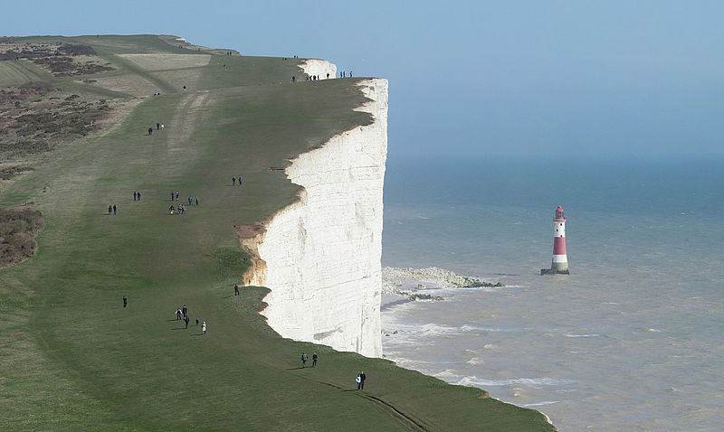
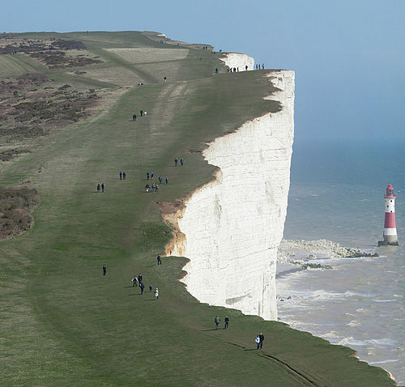

# seamplusplus
Seamplusplus is a simple C++ implementation of the original seam carving algorithm [proposed by Avidan and Shamir in 2007](https://dl.acm.org/doi/10.1145/1275808.1276390). It takes a .png file as its input and then outputs a seam carved version of the input image as a .png file. Seamplusplus uses [LodePNG](https://lodev.org/lodepng/) for image encoding and decoding. Seamplusplus is licenced under GNU AGPL 3.0.
## Usage
Seamplusplus accepts a directory to a valid .png input file, followed by a directory to an output .png file and the number of vertical seams to remove (e.g. `./seamplusplus input.png output.png 50` on Linux systems). 
## Installation
Compilation is the recommended method of installation. To compile the software, simply clone the repository and run `cmake . && make` (on Linux systems) in the repository directory.

## Examples

  
  

 

 

  
  

